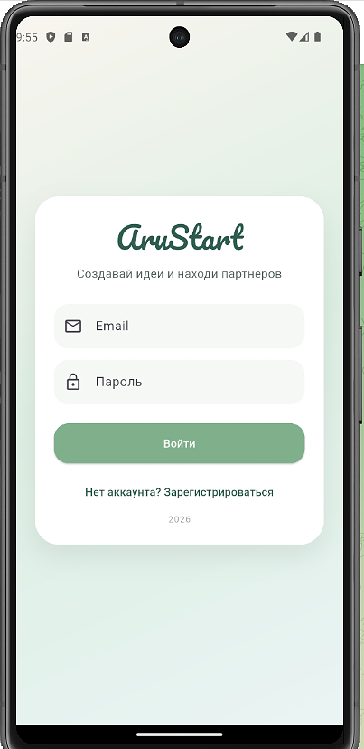
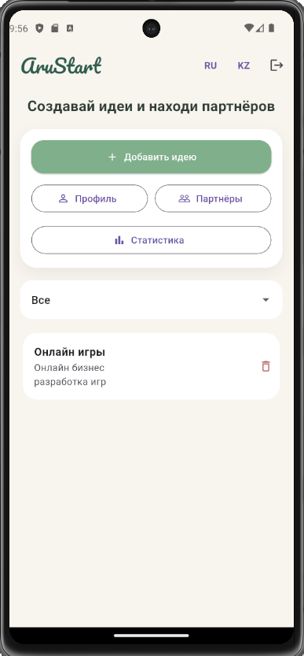
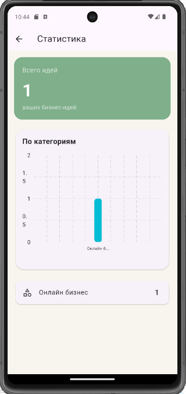

# AruStart

AruStart — стартап идеяларын бөлісуге және серіктес табуға арналған Flutter қосымшасы.

Пайдаланушылар:

* аккаунт құра алады;
* идея қоса алады;
* идеяларды өзгерте және өшіре алады;
* категория бойынша фильтр қолдана алады;
* статистиканы көре алады;
* серіктес іздей алады;
* интернетсіз режимде де деректерді сақтай алады.


# Features

## Authentication

* Firebase Authentication
* Register / Login
* Session сақтау

## Ideas CRUD

* Idea қосу
* Idea өзгерту
* Idea өшіру
* Firestore сақтау

## Filters

* Категория бойынша фильтр

## Statistics

* fl_chart арқылы аналитика

## Offline Mode

* Hive local database
* Интернетсіз режимде идеяларды сақтау

## Localization

* Қазақша / Русский

## Navigation

* go_router navigation


# Tech Stack

* Flutter
* Firebase Auth
* Cloud Firestore
* Riverpod
* go_router
* Hive
* fl_chart
* Material 3


# Project Architecture

```text
lib/
├── core/
├── data/
├── domain/
├── presentation/
└── main.dart
```

### Architecture flow

```text
presentation -> usecase -> repository -> firestore
```


# Screens

* Login Screen
* Register Screen
* Home Screen
* Profile Screen
* Partner Search Screen
* Statistics Screen


# Screenshots

## Login Screen



## Home Screen



## Statistics Screen




# Installation

```bash
git clone https://github.com/AruUkenova/AruStart.git
```

```bash
flutter pub get
```

```bash
flutter run
```


# Release APK

APK:

```text
build/app/outputs/flutter-apk/app-release.apk
```


# Author

Aru Ukenova

Flutter Developer

